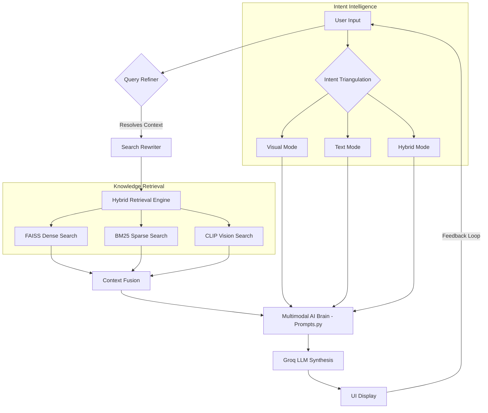

# Image-PDF Multimodal AI Assistant

**Image-PDF Multimodal AI** is a state-of-the-art Multimodal Retrieval-Augmented Generation (RAG) system designed to interact with PDF and Image documents. It goes beyond simple text extraction by "seeing" diagrams, charts, and illustrations while maintaining a sophisticated conversational memory.

---

## Project Structure

```text
Image-pdf-chatbot/
├── app.py              # Main Streamlit application entry point
├── src/                # Core logic modules
│   ├── chat.py         # Response generation logic
│   ├── config.py       # Global settings and thresholds
│   ├── memory.py       # Local conversation indexing (FAISS)
│   ├── ocr.py          # EasyOCR image-to-text management
│   ├── processor.py    # PDF/Image ingestion and extraction
│   ├── prompts.py      # System personas and behavior protocols
│   ├── search.py       # Hybrid retrieval (Dense + Sparse)
│   └── styles.py       # UI/UX CSS styling
├── requirements.txt    # Project dependencies
├── .env                # API Keys (not tracked by git)
└── README.md           # Documentation
```

---

## Key Features

### 1. **Quad-Stage Intent Triangulation**

The system uses a proprietary logic to identify user intent and adapt its response style across four distinct stages:

* **Stage 1: Textual Info**: Professional 3-8 line synthesis for general questions.
* **Stage 2: Textual Example**: Narrative deep-dives for abstract concepts.
* **Stage 3: Visual Specialist**: Minimalist 1-line responses coupled with direct image retrieval for diagrams/charts.
* **Stage 4: Multimodal Synthesizer**: Comprehensive 6-7 line hybrid analysis weaving together text and visuals.

#### **Query Type Strategy Table**

| Stage                              | User Intent              | Input Keywords                        | AI Response Mode                                               |
| :--------------------------------- | :----------------------- | :------------------------------------ | :------------------------------------------------------------- |
| **Stage 1: Textual Info**    | General question         | "What is...", "Explain..."            | **Data Analyst**: 3-8 lines of text only.                |
| **Stage 2: Textual Example** | Deep dive into facts     | "Give me an example", "Sample"        | **Data Analyst**: 3-8 lines of detailed text example.    |
| **Stage 3: Visual Only**     | Direct look at something | "Give me the image", "Diagram"        | **Visual Specialist**: exactly 1 line + image.           |
| **Stage 4: Hybrid (Mixed)**  | Explanation + Visual     | "Explain with a diagram", "Detail it" | **Multimodal Synthesizer**: 6-7 lines of mixed analysis. |

### 2. **Contextual Triangulation & Search Rewriting**

* **Self-Correcting Search**: Automatically rewrites vague follow-up queries (e.g., *"give me an image of it"*) by resolving pronouns and topics from previous conversation turns.
* **Semantic Memory**: Uses a FAISS-based vector database to store and retrieve recent conversation history, ensuring seamless continuity without the "hallucination" of forgetting previous context.

### 3. **High-Fidelity Document Processing**

* **Vision-Aware**: Extracts and pads images to square aspect ratios to maintain **CLIP Model** accuracy.
* **Hybrid Search**: Combines **BM25 (Sparse)** and **FAISS (Dense)** search algorithms for superior text retrieval accuracy.
* **OCR Cleaning**: Silently repairs common OCR artifacts during synthesis to provide professional-grade output.

---

## System Architecture & Data Flow

The system operates on a multi-layered RAG architecture that synchronizes text and vision through a central orchestration pipeline.

### **Architectural Diagram**



### **Data Flow Pipeline**

1. **Ingestion Phase**: PDFs are parsed; text is chunked for FAISS/BM25, and images are extracted, padded, and indexed via CLIP.
2. **Contextual Refinement**: If the user asks a vague follow-up, the system identifies the "Conversation History" and rewrites the query to include the missing subject.
3. **Hybrid Retrieval**: The system executes a simultaneous 3-way search (Semantic Text, Keyword Text, and Vision Similarity).
4. **Triangulation**: The intent engine selects the response mode (Stage 1-4) based on the query complexity and visual triggers.
5. **Synthesis**: The LLM receives a contextually rich prompt containing history, document facts, and specific behavioral constraints.

## The Query-to-Answer Journey

Follow the lifecycle of a single user request through the intelligence pipeline:

1. **Contextual Refinement**: The AI analyzes the query for pronouns (it, that) or vague labels. If detected, it consults the `MemoryManager` to perform a **Semantic Rewrite**, merging the current request with the previous topic.
2. **Intent Triangulation**: The `app.py` engine clarifies the request into one of four stages (Textual Info, Example, Visual, or Hybrid) to select the perfect behavioral prompt from `prompts.py`.
3. **Hybrid Retrieval**: A 3-pronged search is launched:

   * **Semantic Search**: Concepts and meanings
   * **Keyword Search**: Specific terminology matching.
   * **Vision Search**: Image similarity via CLIP embeddings.
4. **Prompt Engineering**: The system assembles a high-density prompt featuring **Conversation History**, **Document Chunks**, and **Strict Persona Constraints** (No meta-talk, zero inference).
5. **Multimodal Synthesis**: The Groq LLM generates the response while `app.py` simultaneously dynamically renders high-resolution visuals if visual intent was confirmed.

---

## Code Implementation Highlights

### **1. Contextual Query Refiner (`app.py`)**

The system resolves pronouns and vague follow-ups by merging them with the previous conversation topic:

```python
if is_vague and (has_trigger or has_pronoun):
    prev_user_q = st.session_state.messages[-3]["content"]
    search_query = f"{prev_user_q} {prompt}"
    print(f"Contextual Search Rewrite: '{prompt}' -> '{search_query}'")
```

### **2. Hybrid Retrieval Fusion (`src/search.py`)**

Combining Dense (FAISS) and Sparse (BM25) search for maximum textual accuracy:

```python
# Hybrid Score = Alpha * Dense + (1 - Alpha) * Sparse
final_score = (Config.HYBRID_ALPHA * s_dense) + ((1 - Config.HYBRID_ALPHA) * s_sparse)
hybrid_results.append((idx, final_score))
```

### **3. Multimodal Prompt Architecture (`src/prompts.py`)**

The systematic protocol for maintaining persona and resolving history:

```python
SYSTEM_PROMPT = """You are a professional Multimodal AI Analyst.

### CONTEXTUAL TRIANGULATION PROTOCOL
1. **Reference Resolution**: Use the [CONVERSATION HISTORY] to identify the subject of pronouns (it, that, this, the subject).
2. **Factual Source**: Use [DOCUMENT CONTEXT] as the EXCLUSIVE source of truth.
3. **Direct Delivery**: Answer the user immediately. DO NOT say "Based on history" or "I assume."
"""
```

### **4. Aspect-Ratio Protected Vision Indexing (`src/processor.py`)**

Padding images to square aspect ratios to prevent CLIP model distortion:

```python
def _pad_image(self, pil_img):
    width, height = pil_img.size
    max_dim = max(width, height)
    new_img = Image.new("RGB", (max_dim, max_dim), (255, 255, 255))
    new_img.paste(pil_img, ((max_dim - width) // 2, (max_dim - height) // 2))
    return new_img
```

---

## Deep Dive: Multimodal Intelligence

The system is designed to bridge the gap between abstract text and physical visuals. Here is how the two most complex systems operate:

### **1. The Vision Engine (CLIP + FAISS)**

Unlike traditional OCR which just "reads" text inside images, this system **understands** the visual content:

* **Aspect-Ratio Protection**: Raw images vary in size. Before indexing, the system pads them into a square white canvas. This prevents the **CLIP Vision Transformer** from squashing the image, preserving the structural integrity of diagrams.
* **Zero-Shot Retrieval**: Your text query is converted into a vector by CLIP’s text encoder. The system then calculates the **Cosine Similarity** between your words and the visual features of every image in the document using FAISS.
* **Contextual Boosting**: To ensure relevance, images that appear on the same page as highly-relevant text chunks receive a **15% score boost**, effectively "re-ranking" them to favor the current topic.

### **3. Image Filtration & Ranking Protocol**

Nexus employs a multi-tier filtration system to ensure only the most relevant visuals reach the user:

* **Vector Thresholding**: CLIP similarity scores are filtered against a strict threshold (`IMAGE_SCORE_THRESHOLD`). Any visual scoring below this is automatically discarded.
* **Intent Gating**: Even if high-confidence images are found, the system will **suppress** their display unless the "Intent Triangulation" engine detects explicit visual keywords (image, diagram, show, etc.).
* **Top-K Selection**: The system dynamically selects only the Top-3 most relevant visuals per query to prevent UI clutter and ensure high conversational focus.

### **4. Automatic Image Cleansing (Logo & Icon Filtration)**

To ensure the AI strictly focuses on meaningful content (diagrams, charts, blueprints) and ignores decorative elements, the system implements a hardware-level dimension filter during extraction:

* **Resolution Gating**: Every image extracted from the PDF is checked against a minimum resolution threshold (250x250 pixels).
* **Logo Suppression**: Smaller elements such as corporate logos, social media icons, page numbers, and UI buttons are automatically discarded before indexing.
* **Noise Reduction**: This pre-processing layer ensures that the Vision Search engine only operates on high-value visual data, significantly reducing "false positive" results where a logo might accidentally match a textual concept.

### **2. Hybrid Query Logic (The Synthesizer)**

Hybrid queries focus on the relationship between text and graphics. When a user asks something like *"Explain this workflow using the diagram,"* the system enters **Stage 4 (Multimodal Synthesizer)**:

* **Intent Pairing**: The system detects both **Information Intent** (explain, why, how) and **Visual Intent** (diagram, show, image).
* **Narrative Integration**: Instead of giving separate text and image answers, the AI is instructed to write an **Integrated Narrative**.
* **System Awareness**: The LLM is explicitly told via the `[SYSTEM]` tag exactly which visuals are currently rendered on the user's screen, allowing it to use phrases like *"As depicted in the flowchart below"* or *"Observe the blue curve in the figure."*

---

### **Tech Stack**

- **Python Version**: 3.13.11
- **UI Framework**: Streamlit (Glassmorphism UI)
- **Language Model**: Groq (Llama-3-70B)
- **Embeddings**: Sentence-Transformers (`all-MiniLM-L6-v2`)
- **Vision Model**: OpenAI CLIP (`clip-vit-base-patch32`)
- **Vector Database**: FAISS (Facebook AI Similarity Search)
- **Document Engine**: PyMuPDF (fitz)
- **OCR Engine**: EasyOCR (for enhanced image context)

### **Core Modules**

* `src/processor.py`: Handles Multimodal PDF/Image ingestion and indexing.
* `src/search.py`: Implements the hybrid search logic (BM25 + FAISS + Page Boost).
* `src/memory.py`: Manages real-time conversational context indexing.
* `src/ocr.py`: Encapsulates EasyOCR logic for image text extraction.
* `src/prompts.py`: The "Brain" containing the Contextual Triangulation Architecture.
* `app.py`: The central pipeline orchestrating intent, search, and the LLM.

## Installation & Setup

### **1. Prerequisites**

- **Python**: 3.13.11 (Recommended)
- **Tesseract OCR**: Required for fallback image text extraction (Install via `apt-get` or download for Windows).

### **2. Clone & Install**

```bash
git clone https://github.com/Dev-jangid/Image-pdf-chatbot-2.git
cd Image-pdf-chatbot-2

# Create and activate virtual environment
python -m venv myenv
source myenv/bin/activate  # Linux/Mac
myenv\Scripts\activate     # Windows

# Install dependencies
pip install -r requirements.txt
```

### **3. Environment Variables**

Create a `.env` file in the root directory and add your Groq API key:

```env
GROQ_API_KEY=your_api_key_here
```

### **4. Run the Application**

```bash
streamlit run app.py
```

---

## Usage Guide

1. **Upload**: Drop a technical PDF or an image of a diagram into the sidebar.
2. **Inquire**: Ask a general question (e.g., *"What is Linear Regression?"*).
3. **Visual Follow-up**: Ask for a visual (e.g., *"Show me the diagram for it"*). The AI will resolve "it" to your previous question and display the relevant visual.
4. **Hard Reset**: Use the **Clear Workspace** button in the sidebar to delete all databases and start totally fresh.

---

## Operational Rules

* **No Meta-Talk**: The AI is strictly forbidden from explaining its reasoning or referencing "Conversation History" in its answers.
* **Strict Image Display**: Visuals are only shown when explicit graphical keywords are detected, keeping the UI clean and relevant.
* **Zero Inference**: Answers are grounded 100% in the provided document context.

---

## License

MIT License - feel free to use and modify for your own projects.
